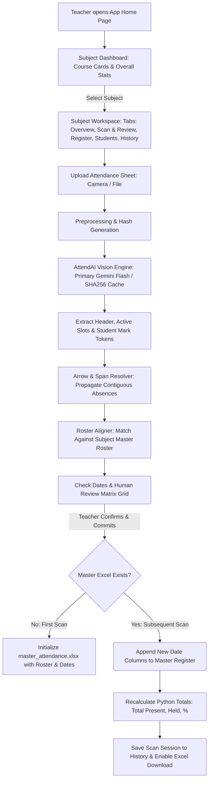

# Product Requirements Document (PRD)
## Project Name: AttendAI — VIT Smart Attendance Digitization System
**Version:** 2.0 (Production Build)  
**Last Updated:** October 2026  
**Status:** Implemented & Verified

---

## 1. Executive Summary & Vision

### 1.1 Problem Statement
At engineering institutes like **Vidyalankar Institute of Technology (VIT)**, faculty record attendance on standardized weekly physical registers. Each sheet spans up to 5 class sessions with printed student rosters (Roll Number, Full Name, Batch 1 & Batch 2) and handwritten entries:
* Handwritten **student signatures** indicating Present (`P`).
* Handwritten pink/red or blue ink **`AB`** indicating Absent (`A`).
* Handwritten **range arrows** (`↑`, `↓`, or long vertical spanning arrows `↕`) marking consecutive absences or batch exemptions.
* Session dates written in column headers (e.g. `9/9/26`, `23/9/26`, `30/9/26`, `7/10/26`).

Collecting, tallying, and manually keying these records into Excel or university ERP portals each week is tedious, error-prone, and causes end-of-semester backlogs.

### 1.2 The Solution & User Vision
**AttendAI** is an intelligent, subject-wise attendance digitization and cumulative management platform:
1. **Subject-Wise Academic Hub**: Faculty organize courses by Subject, Class, Division, and Type (Theory / Practical / Tutorial).
2. **AttendAI Vision Engine**: Automatically digitizes physical VIT register sheets from photos and scans, accurately classifying student signatures, `AB` marks, blank cells, and multi-row range arrows.
3. **Active Slot Detection & Date Validation**: Detects all active date columns even when header dates are handwritten or blank (based on ink density), prompting teachers for confirmation before commit.
4. **Cumulative Master Register (Append Mode)**:
   * **Initial Scan**: Initializes `master_attendance.xlsx` for that subject with student metadata and first session dates.
   * **Subsequent Scans**: Matches each student by **Roll Number**, preserves student names and serial numbers, appends newly verified date columns to the right, and recalculates cumulative totals (`TOTAL`, `HELD`, `ATT %`).

---

## 2. Real-World Sheet Analysis (Standard VIT Register)

```
┌────────────────────────────────────────────────────────────────────────────────────────┐
│ [VIT Logo] Vidyalankar Institute of Tech  Attendance Sheet Academic Year 2026-27 (Odd) │
│                                           B.TECH Programme in Electronics & Comp Sci   │
│ Class: T.Y. B.TECH   Subject: SS   Faculty: SHP   DIV: B   Type: Theory (03)           │
├───────┬────────────┬──────────────────────┬─────────┬─────────┬─────────┬─────────┬────┤
│ Sr.No │ Roll No    │ Name of the Student  │ 9/9/26  │ 23/9/26 │ 30/9/26 │ 7/10/26 │Date│
│       │            │                      │  Sign   │  Sign   │  Sign   │  Sign   │Sign│
├───────┴────────────┴──────────────────────┴─────────┴─────────┴─────────┴─────────┴────┤
│                                       Batch 1                                          │
├───────┬────────────┬──────────────────────┬─────────┬─────────┬─────────┬─────────┬────┤
│   1   │ 24108B0001 │ VEDANT PATOLE        │ [Sign]  │ [Sign]  │ [Sign]  │ [Sign]  │    │
│   2   │ 24108B0002 │ ARYA SURYAVANSHI     │ [Sign]  │ [Sign]  │ [Sign]  │ [Sign]  │    │
│   3   │ 24108B0005 │ AYUSH SAWANT         │   AB    │ [Sign]  │ [Sign]  │ [Sign]  │    │
│  ...  │ ...        │ ...                  │   ...   │   ...   │   ...   │   ...   │    │
│   9   │ 24108B0016 │ PUSHKARAJ KADAM      │    ↑    │ [Sign]  │ [Sign]  │ [Sign]  │    │
│  10   │ 24108B0017 │ AMEY NADHAVALE       │   AB    │ [Sign]  │ [Sign]  │         │    │
│  11   │ 24108B0018 │ MOHAMMAD ZAMAN SHAIKH│    ↓    │   AB    │ [Sign]  │         │    │
├───────┴────────────┴──────────────────────┴─────────┴─────────┴─────────┴─────────┴────┤
│                                       Batch 2                                          │
├───────┬────────────┬──────────────────────┬─────────┬─────────┬─────────┬─────────┬────┤
│  20   │ 24108B0028 │ SUJAL PAWAR          │ [Sign]  │   [↑]   │ [Sign]  │ [Sign]  │    │
│  22   │ 25108B2001 │ NIRJA HATI (DSE)     │ [Sign]  │   [│]   │ [Sign]  │ [Sign]  │    │
│  26   │ 24108B0032 │ ROHAN MUNDHE         │   AB    │   [↓]   │   AB    │         │    │
└───────┴────────────┴──────────────────────┴─────────┴─────────┴─────────┴─────────┴────┘
```

### Key Technical Insights from the Sheet:
1. **Header Metadata**:
   * **Academic Year**: e.g., `2026-27 (Odd)` or `(Even)`
   * **Programme**: e.g., `B.TECH Programme in Electronics and Computer Science`
   * **Class**: e.g., `T.Y.B.TECH` (Third Year)
   * **Subject Code/Name**: e.g., `SS` (Signal And System / System Software)
   * **Faculty Initials**: e.g., `SHP`
   * **Division**: `B`
   * **Session Type**: `Theory` vs. `Practical` (Lab)
   * **Week Number**: Annotated at top header (e.g., `08`, `8`, `9`).
2. **Student Identifiers**:
   * **Regular Roll Numbers**: `24108B0001` – `24108B0036` (`24` = Admission year, `108` = College code, `B` = Branch, `0001` = Serial).
   * **Direct Second Year (DSE) Roll Numbers**: `25108B2001` – `25108B2003`.
   * **Name**: Printed uppercase on paper; stored and presented in clean Title Case (e.g. `Vedant Patole`).
   * **Privacy Rule**: Never use the roll number as a student's name.
3. **Batch Dividers**:
   * Divided by explicit paper divider rows: `Batch 1` (Sr 1–19) and `Batch 2` (Sr 20–30).
4. **Attendance Marking Patterns**:
   * **Present (`P`)**: Handwritten signatures (cursive pen strokes).
   * **Absent (`A`)**: Explicitly written as `AB` or `A`.
   * **Range Marking (Arrows)**: 
     - Arrows `↑` / `↓` extending from an `AB` mark indicate contiguous absent students.
     - Spanning lines/arrows (`↕`) indicate continuous range marking across consecutive rows.
   * **Active Slot Detection Rule (Overriding "ignore blank header")**:
     - A slot is **ACTIVE** if it has a written date **OR** at least 20% of its cells contain ink/marks (`SIGN`, `AB`, arrows, etc.).
     - Only slots with **no date AND no marks** are ignored (e.g. true blank 5th column).
     - Active slots without a date are labelled `"Date missing (column N)"` and require teacher confirmation before commit.

---

## 3. System Architecture & Workflows



---

## 4. Feature Specifications

### 4.1 Module 1: Subject Management (Home Page)
* **Subject Cards Overview**:
  * Title: Subject Name (e.g., *Signal And System — SS*).
  * Subtitle: Class & Division (e.g., *T.Y. B.Tech — Div B*).
  * Metadata: Faculty initials (e.g., `SHP`), Session Type (`Theory` / `Practical`).
  * Live Metrics:
    * Classes Held (e.g., `4 Classes`).
    * Enrolled Students (`30 Students`).
    * Average Attendance Percentage (`78.5%`).
* **Actions**:
  * **Add Subject Modal**: Create subject with Class, Division, Type, Faculty, Academic Year.
  * **Delete Subject**: Remove subject and associated records with confirmation.
  * **Direct Export**: Download latest `master_attendance.xlsx`.

### 4.2 Module 2: AttendAI Vision & Sheet Scanning Engine

#### 1. Architecture & Multi-Model Resiliency
* **Primary Engine**: `GeminiEngine` utilizing `gemini-3.5-flash` with automatic fallback to `gemini-3.8-flash` / `gemini-3.1-flash-lite`.
* **Health Check & Caching**:
  * 60-second health caching to protect rate limits.
  * Status Chip: `AttendAI Vision: Online` or `Manual mode`.
  * Disk-based SHA256 caching for instant replay of unchanged sheets.
* **Privacy Controls**:
  * `columns_only` (default): Crops only date/sign columns locally before external analysis.
  * `full_page`: Analyzes complete page layout.
  * Student PII protection: Model does not log or leak sensitive student data.

#### 2. Active Slot & Blank Header Logic
* **20% Ink Rule**: An unlabelled column is marked active if $\ge 20\%$ of its rows contain marks.
* **Missing Date Resolution**:
  * Flagged as `"Date missing (column N)"`.
  * Suggests `previous date + 7 days`.
  * Requires faculty input/confirmation before committing.

#### 3. Arrow & Span Resolver
* Resolves directional arrows (`↑`, `↓`) and vertical spanning bars.
* Propagates anchor tokens (e.g. `AB`) across all intermediate student cells.

#### 4. Review & Verification Interface
* **Dual Review Modes**:
  * **Full Matrix Grid**: Interactive table with sticky student name column, batch headers, and clickable status pills:
    * 🟢 **P (Present)**
    * 🔴 **A (Absent)**
    * ⚪ **NM (Not Marked)**
  * **Quick Fix Queue**: Guided review focused only on uncertain or unconfirmed cells.
* Single-click toggle to update attendance status before committing.

### 4.3 Module 3: Cumulative Master Register & Excel Engine

Master file location:
`data/subjects/{subject_id}/master_attendance.xlsx`

```
┌───────┬────────────┬──────────────────────┬───────┬─────────┬─────────┬─────────┬─────────┬───────┬───────┬────────┐
│ Sr.No │ Roll No    │ Name of the Student  │ Batch │ 9/9/26  │ 23/9/26 │ 30/9/26 │ 7/10/26 │ TOTAL │ HELD  │ ATT %  │
├───────┼────────────┼──────────────────────┼───────┼─────────┼─────────┼─────────┼─────────┼───────┼───────┼────────┤
│   1   │ 24108B0001 │ Vedant Patole        │   1   │    P    │    P    │    P    │    P    │   4   │   4   │ 100.0% │
│   2   │ 24108B0002 │ Arya Suryavanshi     │   1   │    P    │    P    │    P    │    P    │   4   │   4   │ 100.0% │
│   3   │ 24108B0005 │ Ayush Sawant         │   1   │    A    │    P    │    P    │    P    │   3   │   4   │  75.0% │
│  ...  │ ...        │ ...                  │  ...  │   ...   │   ...   │   ...   │   ...   │  ...  │  ...  │   ...  │
│  22   │ 25108B2001 │ Nirja Hati           │   2   │    P    │    A    │    P    │    P    │   3   │   4   │  75.0% │
└───────┴────────────┴──────────────────────┴───────┴─────────┴─────────┴─────────┴─────────┴───────┴───────┴────────┘
```

#### Merge & Append Algorithm:
1. **Load Existing Master**: Reads existing roll numbers, names, batches, and previously recorded dates.
2. **Date De-Duplication**:
   * If a scanned date matches an existing column, updates that column's entries.
   * If the date is new, appends the new column to the right before summary formulas.
3. **Student Record Integrity**:
   * Primary key: `roll_no` (e.g., `24108B0001`, `25108B2001`).
   * Names preserved in Title Case.
   * Sequential serial numbers (1..30).
4. **Totals & Formulas**:
   * **Total Present (`TOTAL`)**: Count of `P` sessions for student.
   * **Classes Held (`HELD`)**: Total valid sessions conducted for that batch.
   * **Attendance % (`ATT %`)**: `(TOTAL / HELD) * 100`.
   * OpenPyXL formulas enabled for dynamic calculations in exported `.xlsx`.
   * Python-computed values displayed in UI preview to prevent `None` or `#VALUE!` artifacts.

### 4.4 Module 4: Workspace Tabs & User Experience
* **Tab 1: Overview**: Subject metadata, quick statistics, and recent scan logs.
* **Tab 2: Scan & Review**:
  * Drag-and-drop file uploader (PNG, JPG, JPEG).
  * Date verification bar with suggestion chips.
  * Interactive review grid with batch divider bands.
  * One-click "Commit to Master Register" button.
* **Tab 3: Register Preview**:
  * Live HTML table rendering cumulative attendance matching the master Excel structure.
  * Sticky student names and batch groupings.
  * Direct "Download Master Excel (.xlsx)" action.
* **Tab 4: Students Roster**:
  * Complete student directory with search by name/roll number and batch filter chips.
  * Inline name and batch editing with backend persistence (`PATCH /api/subjects/{id}/students/{student_id}`).
  * "Re-sync Roster from Sheet" repair utility (`POST /api/subjects/{id}/roster/fix-from-sheet`).
* **Tab 5: Scan History**:
  * Historical log of scan sessions classified by status (`Committed` vs `Draft`).
  * Date chips, detected session count, and scan timestamp.
  * Actions: "Resume Review" for drafts; "Download Excel" for committed sessions.

---

## 5. Directory & Data Structure

```text
AttendAI/
├── data/
│   ├── app.db                              # SQLite database (Subjects, Students, ScanSessions, Attendance)
│   ├── cache/vision/                       # SHA256 cached JSON extraction results
│   └── subjects/
│       └── {subject_id}/                   # Subject directory (e.g. tybtech_b_ss_theory)
│           ├── master_attendance.xlsx      # Cumulative Master Excel file
│           ├── roster.json                 # Student list cache
│           └── scans/                      # Archived raw page images
├── backend/
│   ├── main.py                             # FastAPI application entrypoint & lifespan
│   ├── config.py                           # Application settings & environment configuration
│   ├── database.py                         # SQLAlchemy database models & session management
│   ├── schemas.py                          # Pydantic schemas for API requests & responses
│   ├── routes/
│   │   ├── subjects.py                     # Subject CRUD, roster repair & student edit endpoints
│   │   └── attendance.py                   # Upload, preview, commit & download endpoints
│   ├── vision/
│   │   ├── arrow_resolver.py               # Spanning arrow propagation engine
│   │   ├── roster_aligner.py               # Fuzzy/exact alignment to registered roster
│   │   └── engines/
│   │       ├── base.py                     # VisionEngine interface & data models
│   │       ├── gemini_engine.py            # Primary AttendAI Vision engine (Gemini Flash)
│   │       ├── claude_engine.py            # Secondary cloud engine
│   │       └── manager.py                  # Multi-engine fallback orchestrator & SHA256 cache
│   └── excel/
│       └── cumulative_merger.py            # OpenPyXL cumulative append & recalculation engine
├── frontend/
│   └── app.py                              # Streamlit 5-tab academic dashboard application
├── ui/
│   └── components.py                       # Premium HTML/CSS design system & table renderers
├── scripts/
│   └── repair_roster.py                    # Roster audit & normalization script
├── weights/
│   └── tsr_yolo_retrained.pt               # Retrained local table structure weights
├── .env                                    # Active environment configuration
├── .env.example                            # Configuration template
├── run.bat                                 # Windows one-click dual launcher
└── requirements.txt                        # Python dependencies
```

---

## 6. Core API Endpoints

| Method | Endpoint | Description |
| :--- | :--- | :--- |
| `GET` | `/api/health` | Health check endpoint returning `AttendAI Vision: Online` status chip. |
| `GET` | `/api/diagnostics` | System diagnostics showing provider connectivity and recent page stats. |
| `GET` | `/api/subjects` | List all subjects with metrics (classes held, students, avg attendance). |
| `POST` | `/api/subjects` | Create a new academic subject. |
| `GET` | `/api/subjects/{id}` | Retrieve subject details, scan history, and roster. |
| `DELETE` | `/api/subjects/{id}` | Delete subject and its associated database/file records. |
| `PATCH` | `/api/subjects/{id}/students/{student_id}` | Update student name or batch assignment inline. |
| `POST` | `/api/subjects/{id}/roster/fix-from-sheet` | Re-normalize student roster (title case names, 1..30 serials, batch splits). |
| `POST` | `/api/subjects/{id}/scan` | Upload sheet image for extraction; returns active slots and editable grid. |
| `POST` | `/api/subjects/{id}/commit` | Commit reviewed attendance; updates database and appends to `master_attendance.xlsx`. |
| `GET` | `/api/subjects/{id}/download` | Download cumulative `master_attendance.xlsx` spreadsheet. |
| `POST` | `/api/vision/clear-cache` | Invalidate image vision cache for re-analysis. |

---

## 7. Edge Cases & Reliability Solutions

1. **Blank Date Headers with Ink Marks**:
   * *Problem*: Scanned sheet has filled signature columns but blank date headers.
   * *Solution*: 20% ink density threshold marks column active; labelled `"Date missing (column N)"`; prompts teacher with suggested date (+7 days) before commit.
2. **Continuous Spanning Arrows (`↑`, `↓`, `↕`)**:
   * *Solution*: `arrow_resolver.py` traces arrowheads and continuous bounding spans, propagating the parent anchor mark (`AB`) to all enclosed student rows.
3. **Overwritten Paper Corrections**:
   * *Solution*: Signature priority heuristic: valid handwritten signatures override crossed-out marks.
4. **Lateral Entry (DSE) Roll Numbers**:
   * *Solution*: Standardized regex `r"^2[45]108[Bb]\d{4}$"` accurately parses both standard admission (`24108B...`) and DSE (`25108B...`).
5. **Name & Serial Number Preservation**:
   * *Solution*: Roll numbers are never displayed or stored as student names. Roster is normalized to sequential serial numbers (1..30) and proper Title Case.
6. **Cloud Rate Limits & Spikes (429 / 503)**:
   * *Solution*: Exponential backoff retry, health check caching (60s), and multi-model failover (`gemini-3.5-flash` $\rightarrow$ `gemini-3.8-flash` $\rightarrow$ `gemini-3.1-flash-lite`).

---

## 8. Implementation Status

- [x] **Phase 1: Foundation & Layout Extraction**
  - Table segmentation, cell cropping, and ink mark detection.
- [x] **Phase 2: Specialized VIT Sheet Pipeline**
  - Multi-row arrow resolver (`arrow_resolver.py`).
  - Blank-header active slot detection with 20% ink density heuristic.
  - Lateral entry / DSE roll number normalization.
- [x] **Phase 3: Cumulative Excel Merger**
  - OpenPyXL append engine preserving formula columns (`TOTAL`, `HELD`, `ATT %`).
  - Atomic file writing with backup (`.bak.xlsx`) protection.
- [x] **Phase 4: Multi-Subject Academic Dashboard**
  - Subject cards with live attendance calculations.
  - Direct master Excel export.
- [x] **Phase 5: Roster & Serial Number Integrity**
  - Fixed sequential numbering (1..30) and batch dividers (1–19, 20–30).
  - Student directory with inline name/batch editing.
  - "Never use roll number as student name" rule enforced across DB and UI.
- [x] **Phase 6: UI/UX Redesign & App Shell**
  - Custom design tokens, dark/light contrast compliance, and no default Streamlit appearance.
  - Interactive Review Matrix with sticky student columns and clickable pills.
  - Real-time `TOTAL`, `HELD`, and `ATT %` computation for register preview.
  - Draft vs. Committed history cards with thumbnails and action buttons.
